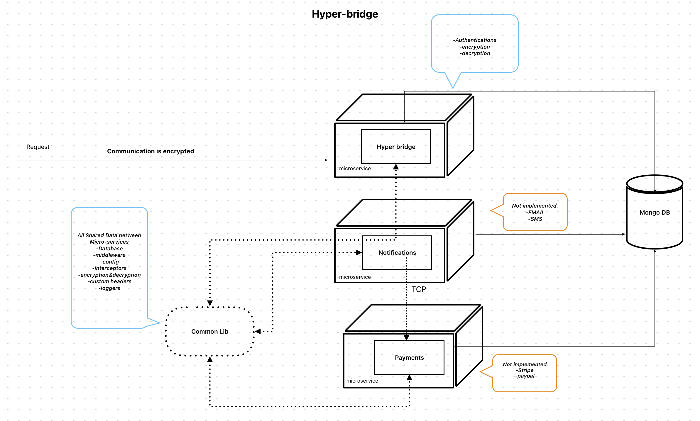
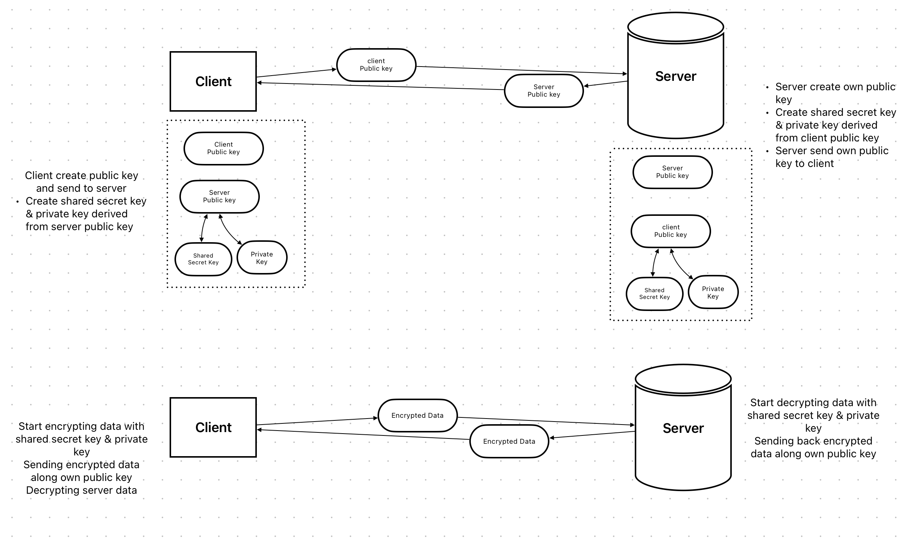

## Hyper Bridge

Hyper Bridge with [NestJS](https://github.com/nestjs/nest) microservices.<br />
Schema of project:

The Encryption Part:


## Installation

```bash
$ yarn install
```

## Running the app

```bash
# running mongo
$ docker-compose up

# development
$ yarn run start
# running on port 3000
```

## Encryption:

Encryption algorithm is aes-256-cbc & the keys are generate using DiffieHellman from crypto package `getDiffieHellman('modp15')`

Created another repository [hyper-bride-consumer](https://github.com/mohsenkhashei/hyper-bridge-consumer/tree/develop) for simulate usage of hyper-bridge, this is the [encryption approach](https://github.com/mohsenkhashei/hyper-bridge-consumer/blob/develop/src/helper/encryption.helper.ts)

## API:

- http://localhost:3000/api/register

```bash
# request body [POST]
{
  "publicKey":"key",
  "deviceId": "20202033314",
  "name": "macbook"
}
# response
{
  "responseType": "JSON",
  "data": {
      "deviceId": "20202033314",
      "name": "macbook",
      "serverPublicKey": "key",
      "publicKey": "key",
      "preferences": [],
      "notifications": {
          "email": false,
          "sms": false,
        }
    }
}
```

- http://localhost:3000/api/auth

```bash
# header ( send your public key in header )
{ key: yourPublicKey }
# create $encryptData this request using Encryption part
{
  "customerNo": 54321, "password": "12345"
}
# make request with $encryptData
# request body [POST]
{
    "requestType": "HASH",
    "data": "$encryptData"
}
# you need to decrypt data through Encryption part
# response
{
    "responseType": "HASH",
    "data": "encrypted data"
}
# After decrypting you will get the JSON data like this:
{
    "customerNo": 54321,
    "userId": "480887dc-adfc-4786-9dd9-d2670264a955",
    "firstName": "Mohsen",
    "lastName": "Khashei",
    "email": "muhsenkhasheii@gmail.com",
    "phoneNumber": 959595959,
    "address": "cyprus nicosia",
    "imageUrl": "http://testImage.jpg",
    "passportNo": "p393939",
    "devices": [
        {
            "deviceId": "2342342324",
            "name": "mohsenkhashei",
            "serverPublicKey": "key",
            "publicKey": "key",
            "preferences": [],
            "notifications": {
                "email": false,
                "sms": false,
            }
        }
    ]
}
```

[](https://app.getpostman.com/run-collection/1566887-79f2b501-f517-452f-898d-3301c5284210?action=collection%2Ffork&source=rip_markdown&collection-url=entityId%3D1566887-79f2b501-f517-452f-898d-3301c5284210%26entityType%3Dcollection%26workspaceId%3Df20b8551-2f10-4363-b926-f1d77d8643ff)

#### upcomming updates:

- adding Authorization like (JWt and ...)
- adding custom validation
- improve logging
- adding rate limiting
- adding Notification microservice for Email, SMS and etc and adding messaging queue like Rabbitmq
- using transaction in mongodb
